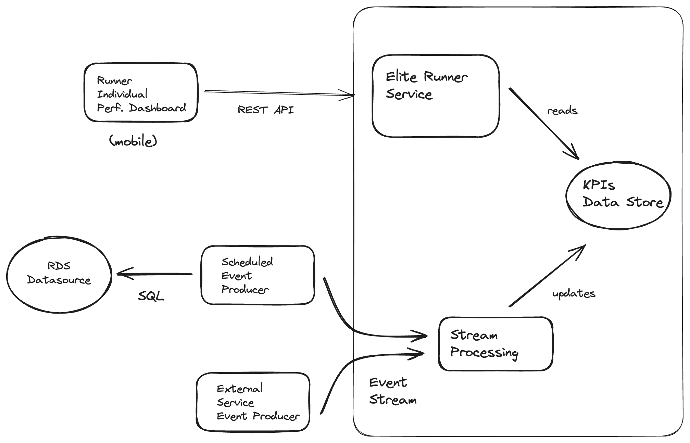

# Proposal

## Requirements

See [REQUIREMENTS.md](REQUIREMENTS.md)

## Overview

The architecture is designed to provide real-time KPI analytics to a mobile application for runners, with a system that is capable of handling both batch and real-time data processing workloads.

1. **Runner Individual Perf. Dashboard (mobile):**  Mobile application that provides performance metrics to runners.

2. **Elite Runner Service (REST API):** This is a service layer that exposes an API, most likely to provide the mobile dashboard with data regarding the runners' performance. It uses the REST architecture, which is standard for web services that are consumed by mobile apps and other clients.

3. **KPIs Data Store:** This is a storage component where the Key Performance Indicators data is stored. 

4. **Stream Processing:** This component is responsible for processing data streams in real-time. It would handle a continuous flow of data, process it, and transform it for storage and analysis in the KPIs Data Store.

5. **External Service Event Producer:** This component or service generates events from external services. These events are then sent into the Event Stream for processing. 

6. **Scheduled Event Producer:**  This component generates events on a schedule. It might be used to trigger certain operations at regular intervals, especially on data sources that lack streaming capabilities. This component implements a Batch-to-Events strategy, allowing the system to leverage the benefits of real-time data processing even when the initial data source only supports batch data.

7. **RDS Data Source:** It's used here to store and manage data that can be queried using SQL.
